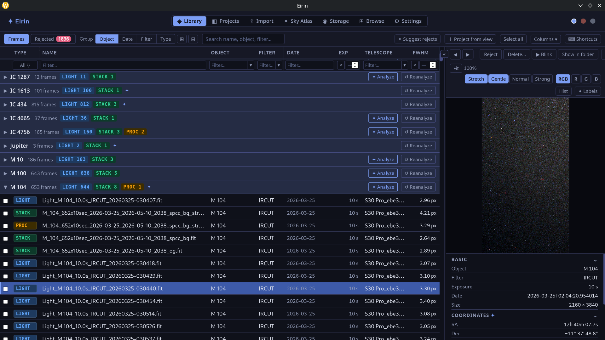
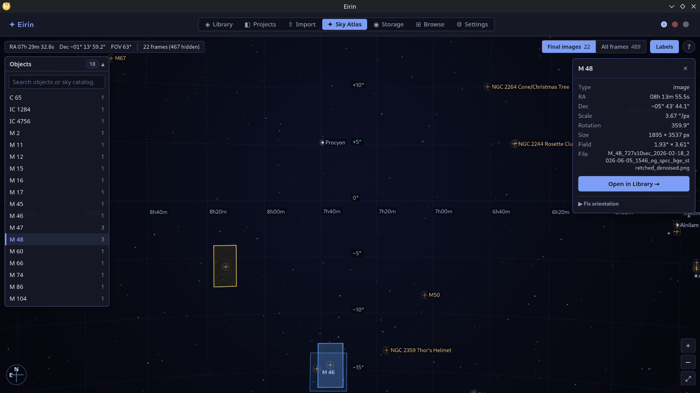

# Eirin

Eirin (/ˈei̯rɪn/) is a desktop app for managing an astrophotography library. It keeps all your subs, calibration frames and finished images in one folder (ideally on a NAS), lets you preview and cull FITS frames, and sets up Siril projects for stacking. Built with Go, Wails and Svelte.

**Website:** https://eirin.hawawa.org



## What it does

- **Import** from a Seestar into your library folder, skipping files you already have. It can delete from the device afterwards, but only once a full SHA-256 of each copy matches.
- **Library** of every frame under the root folder, grouped by object, date, filter or type, with filters and search.
- **FITS preview** with autostretch, debayering of one-shot-colour frames, and blinking through a set. Reject bad frames (hidden, not deleted) or delete them for good.
- **Projects** for Siril: a local folder with `lights/`, `darks/`, `flats/` and `biases/`, symlinked to the frames on the NAS. Open it in Siril, then import the results back.
- **Sky Atlas**: your plate-solved images drawn in their real place on the sky, so you can see what you've mapped so far ([more below](#sky-atlas)).

<details>
<summary><b>ℹ️ Mounting the Seestar on Linux (for Import)</b></summary>

The Seestar shares its storage over SMB. Mount it somewhere (needs `cifs-utils`) and pick that folder as the import source:

```sh
mkdir -p ~/mnt/seestar
sudo mount -t cifs -o guest,uid=$(id -u) "//seestar.local/EMMC Images/" ~/mnt/seestar
```

Unmount when you're done:

```sh
sudo umount ~/mnt/seestar
```

If `seestar.local` doesn't resolve, use the Seestar's IP address instead. I keep these as aliases in my shell config:

```sh
alias seestarmount='sudo mount -t cifs -o guest,uid=$(id -u) "//seestar.local/EMMC Images/" $HOME/mnt/seestar'
alias seestarunmount='sudo umount $HOME/mnt/seestar'
```

</details>

## Sky Atlas

Every plate-solved image knows where it was pointing, how much sky it covers and at what angle. The Sky Atlas uses that to draw your images in their real place on a chart of the sky, with bright stars and Messier/NGC objects marked for reference.

It's not a planetarium and it's not trying to be Stellarium. It's a fun way to look back at what you've captured: which targets sit next to each other, which parts of the sky you've already covered, and where the gaps are. Every new target fills in a bit more of your own map.



Frames with coordinates in their FITS header show up as soon as they're indexed; the rest can be plate-solved from the Library through Siril. Click an outline to overlay the image, switch between final images and every sub, or search for a target and jump to it.

---

More screenshots and a walkthrough of the workflow are on the [website](https://eirin.hawawa.org).

## Why this project exists

I have a Seestar S30 Pro and S50 Pro, and processing the data on my computer (as opposed to the live stacking it does in the app) had a slightly awkward workflow consisting of multiple bash and Python scripts to copy each session and then prepare the same session for Siril. Furthermore, inspecting all the FITS and deleting bad ones was a subpar experience: Siril won't (easily) let you completely delete files, ASIFitsView doesn't debayer the files and moving through different folders is painful.

The setup worked, but I wanted something a bit more user friendly, and, in general, *fun* to use, so I built this.

Eirin is aimed at helping you do all the data management, while the actual stacking and processing is done by a different software (namely, Siril, but it might support PixInsight in the future).

## Installing

### Linux

Grab the latest release from the [Releases page](https://github.com/hawawa4/eirin/releases). Three formats are published:

- **`.zip`**: extract and run the `eirin` binary directly
- **`.deb`**: `sudo apt install ./eirin-linux-amd64.deb` (Debian/Ubuntu and derivatives)
- **`.AppImage`**: `chmod +x eirin-linux-amd64.AppImage && ./eirin-linux-amd64.AppImage` (portable, works on most distros)

All three require `libwebkit2gtk-4.1-0` to be installed (the `.deb` declares this as a dependency automatically).

For processing you'll also need [Siril](https://siril.org). Eirin looks for it on your `PATH`, or you can point it at the binary in Settings.

### Windows / macOS

Not yet published. Build from source (see [Development](#development) below).

### Headless (Docker)

A read-only viewer for your finished images and the Sky Atlas, for running on another machine (e.g. next to the NAS), is published to `ghcr.io/hawawa4/eirin-server` on tagged releases. All the work still happens in the desktop app; the server shows what it publishes. See [Headless/server mode](#headlessserver-mode).

## Development

### Prerequisites

| Tool | Tested version |
|------|---------------|
| Go | 1.25+ |
| Node.js | 22+ |
| Wails CLI | v3 (alpha) |
| staticcheck | v0.7.0+ |
| just | any recent |

Install Go tools once (`-tags gtk3` targets Linux's older webkit2gtk-4.1 stack, see the [Linux/Ubuntu note](#linux--ubuntu-note) below; omit it on macOS/Windows):
```
go install -tags gtk3 github.com/wailsapp/wails/v3/cmd/wails3@latest
go install honnef.co/go/tools/cmd/staticcheck@latest
```

Install dependencies:
```
just install-backend
just install-frontend
```

### Running in dev mode

```
just dev
```

Wails launches a live-reload server: Go backend recompiles on save, Svelte/Vite handles frontend HMR. The app window opens automatically.

### Building a production binary

```
just build
```

Output is placed in `bin/`.

Other useful build recipes:
- `just build-backend`: Go backend only, no frontend/Wails packaging (`go build ./`)
- `just build-frontend`: Svelte frontend only (`npm run build` in `frontend/`)
- `just build-server`: headless server binary for Docker (`eirin-server`, see [Headless/server mode](#headlessserver-mode) below)
- `just test` / `just test-server`: Go unit tests for the desktop and the headless server build
- `just check`: type-check only (`go build ./...` + `svelte-check`/`tsc`), no binaries produced
- `just lint` / `just format`: staticcheck + ESLint/Prettier

TODO: only Linux binaries are built and released right now (see [Installing](#installing)); Windows/macOS builds work locally via `wails3`/Task but aren't wired into CI yet.

### Website

The project website is a separate [Astro](https://astro.build) site in `landingpage/`, built to static HTML and published as a small nginx image, `ghcr.io/hawawa4/eirin-landingpage` (port 8080), on every push to `main` that touches it. It uses the screenshots in `docs/img/` (same as this README) and the clips in `docs/vid/`.

```
just install-landing
just landing-dev     # live-reload dev server
just landing-build   # static build into landingpage/dist/
just landing-docker  # build the nginx image locally as eirin-landingpage
```

## Technical details

### Linux / Ubuntu note

Wails requires a WebKit GTK library. Ubuntu 22.04+ and derivatives (including PikaOS) ship `libwebkit2gtk-4.1` rather than the older `4.0` variant:

```
sudo apt install libwebkit2gtk-4.1-dev
```

Wails v3 defaults to GTK4/webkitgtk-6.0 on Linux; this project targets the older GTK3/webkit2gtk-4.1 stack instead via the `gtk3` build tag, which `build/linux/Taskfile.yml` already passes to `go build`/`wails3 generate bindings` automatically. The `wails3` CLI itself also needs to be installed with that tag (`go install -tags gtk3 github.com/wailsapp/wails/v3/cmd/wails3@latest`), otherwise installing the CLI fails looking for GTK4 headers.

### Preferences database

Eirin stores metadata about the files in an SQLite database. By default, it's stored in the platform config directory:

| Platform | Path |
|----------|------|
| Linux | `~/.config/eirin/prefs.db` |
| macOS | `~/Library/Application Support/eirin/prefs.db` |
| Windows | `%AppData%\eirin\prefs.db` |

It can be overridden by setting the environment variable `EIRIN_DB_PATH`.

### Localhost port

Due to the `wails` architecture, Eirin will start a webserver on a local port. If that port is taken, you might have to set the environment variable `EIRIN_PORT`.

### Headless/server mode

`just build-server` builds a `-tags server` binary for headless Docker deployment (run `just build-frontend` first; the binary embeds `frontend/dist`). It's a **read-only viewer**: the stacked, processed and raster images in your library, one at a time, plus the Sky Atlas. No import, culling, Siril processing, projects, storage stats or file browsing, and nothing it can write: every write method returns an error in this build, and it only serves files that are in its library.

It doesn't share the desktop's database. Instead:

1. In the desktop app, turn on **Settings → Server viewer**. The app then writes a copy of its library database to `<library>/.eirin/library.db`, a couple of minutes after changes and when it closes.
2. The server watches that file (once a minute), copies it locally, rewrites the paths to where the library is mounted on the server (`EIRIN_ROOT`), keeps only the final images, and swaps it in. Open browser tabs refresh by themselves.

Pre-built images are published to `ghcr.io/hawawa4/eirin-server` on tagged releases:

```yaml
services:
  eirin-server:
    image: ghcr.io/hawawa4/eirin-server:latest
    restart: unless-stopped
    ports:
      - "8080:8080"   # web UI
      - "7070:7070"   # REST API (/api/status, /api/frames, /api/image); optional
    volumes:
      - /mnt/nas/Astro:/library:ro   # your library; the path inside doesn't need to match the desktop's
      - ./eirin-data:/data           # the server's local copy of the snapshot
```

| Variable | Default (in the image) | |
|---|---|---|
| `EIRIN_ROOT` | `/library` | Where the library is mounted. Required. |
| `EIRIN_DB_PATH` | `/data/library.db` | The server's local copy of the snapshot. Disposable: it's rebuilt from the next snapshot. |
| `WAILS_SERVER_PORT` | `8080` | Web UI port. |
| `EIRIN_PORT` | `7070` | REST API port. |

The viewer has no login. Theme and layout preferences are kept per browser.

To build the image locally instead: `docker build -t eirin-server .` (`just docker-build` uses buildx's `local` output instead, extracting the static `eirin-server` binary to `./dist/` rather than producing a runnable image).

Two independent HTTP listeners run in the container: Wails' own server (serves the Svelte frontend, `WAILS_SERVER_PORT`, default 8080) and Eirin's side-channel REST API (`/api/status`, `/api/frames`, `/api/image`, via `EIRIN_PORT`, default 7070).

## AI disclaimer

A significant amount of the code in this project was AI generated, I don't try to hide that fact: I can't write any respectable frontend code, but I'm half decent at backend and systems design. This project was also the first time I used `wails`.

## Similar software

There's other wonderful astrophotography software with some overlap in features, so you might be asking "why would I use this instead?"

- [Astro Catalogue Viewer](https://github.com/thebioguy/Astro-Catalogue-Viewer): Genuinely great and fun to use software; does a similar thing of cataloguing images automatically, and the overall UX is reminiscent of a bird watching journal. It does not help with the processing step, but I can highly recommend it for viewing your finished images.
- [SSLM](https://github.com/AstroNoob-Tools/SSLM): Windows only, focusing entirely on the Seestars.

## License

MIT, see [LICENSE.md](LICENSE.md).
